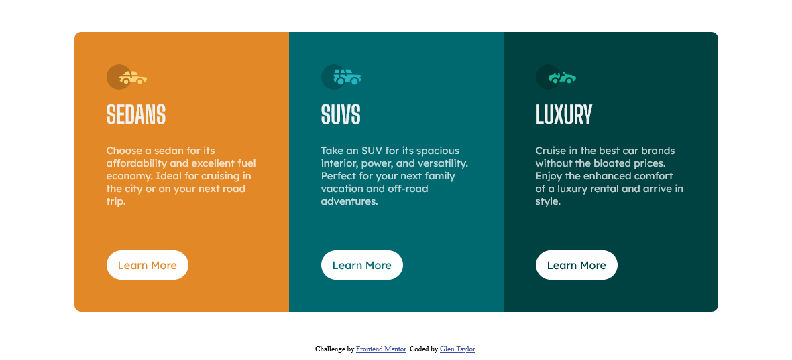

# Frontend Mentor - 3-column preview card component solution

This is a solution to the [3-column preview card component challenge on Frontend Mentor](https://www.frontendmentor.io/challenges/3column-preview-card-component-pH92eAR2-). Frontend Mentor challenges help you improve your coding skills by building realistic projects.

## Table of contents

- [Overview](#overview)
  - [The challenge](#the-challenge)
  - [Screenshot](#screenshot)
  - [Links](#links)
- [My process](#my-process)
  - [Built with](#built-with)
  - [What I learned](#what-i-learned)
  - [Continued development](#continued-development)
  - [Useful resources](#useful-resources)
- [Author](#author)
- [Acknowledgments](#acknowledgments)

## Overview

### The challenge

Users should be able to:

- View the optimal layout depending on their device's screen size
- See hover states for interactive elements

### Screenshot



### Links

- Solution URL: [https://instructiondesigns.org/3-column-preview-card-component/](https://instructiondesigns.org/3-column-preview-card-component/)
- Live Site URL: [https://instructiondesigns.org/3-column-preview-card-component/](https://instructiondesigns.org/3-column-preview-card-component/)

## My process

I decided that this layout lent itself well to using CSS Grid. The mobile first approach did not require that the grid container be set at the outset, I still set it on the container element. This way I just had to add the grid-template-columns setting within the media quiry for larger screens. As I mention below, one of the main challenges within the desktop layout is preventing the paragraph from offsetting the alignment og the 'Learn More' buttons. In order to solve for this I added a flex container lement and used the justify content setting to keep the buttons in horizontal alignment. Finally, another element I spent some time on was the application of the border radius to the first card content and last card content elements. I wanted a solution that would allow for the addition of more card content elements. So, I used the first-child and last-child selectors to apply the border radius.

### Built with

- Semantic HTML5 markup
- CSS custom properties and variables
- Flexbox
- CSS Grid
- Mobile-first workflow

### What I learned

The CSS below was used to keep all three buttons in the desktop layout at the same horizontal alignment when the DOM window would vary. This prevented the paragraph from disrupting the alignment of the "Learn More" buttons in the destop layout. Also, I used the first-child and Last-child selectors to apply the border-radius. This should work well if the site added more card content panes to the design.

```css
.card__content {
  display: flex;
  flex-direction: column;
  justify-content: space-between;
  height: 100%;
}

main div:first-child {
  border-radius: 10px 10px 0 0;
}

main div:last-child {
  border-radius: 0 0 10px 10px;
}
```

### Continued development

I decided to use CSS Grid for the layout for the desktop version of this challenge. However, I had an issue with keeping the buttons aligned horizontally because as the DOM window changed size the paragraph would push one button down in one coumn while leaving the others because of the variance in content in each grid item. So, I had to emply flexbox to take advantage of justify-content / space-between to keep all three buttons at the same horizontal alignment.

### Useful resources

- [CSS Tricks Forum](https://css-tricks.com/forums/topic/last-child-not-working/) - I knew I wanted to use the first-child and last-child slector to apply the border radius on the card lements. However, I was having difficulty with the selector. This forum post helped me solve that issue and select on the correct elements.

## Author

- Website - [Glen Taylor](https://www.glenmtaylor.com)
- Frontend Mentor - [@chiptaylor](https://www.frontendmentor.io/profile/chiptaylor)
- Twitter - [@leaderchip](https://www.twitter.com/leaderchip)
